# 2025_1_ServerProgramming 

### 1주차 학습 내용:  

1. 네트워크 토폴로지 이론  

    Star, Mesh, Ring, Bus등 구조와 그에 따른 장단점

2. OSI 7계층  

    OSI 7계층이 만들어진 배경과 각 계층의 역할
    

3. WAN / LAN  

    WAN과 LAN의 구분

### 2주차 학습 내용:  

1. OSI 참조 모델  
    각 레이어에 있는 프로토콜의 예시  
    
    
2. 프로토콜의 통신 단위  
    ethernet - Frame 
    IP - Packet 
    TCP - Segment 
    UDP - Datagram 
    HTTP - Message 

3. 통신 단위들의 구조  
    이더넷 프레임의 구조는 이렇다.
    

    #### MTU = 이더넷 한 프레임에 들어가는 최대 데이터 사이즈

    이더넷 페이로드는 42비트 아래로 들어오면 42비트 까지는 0으로 채워서 보낸다. 

    Octets => 8비트  
    Byte 로 표기하지 않는 이유는 예전에는 1Byte가 꼭 8bit이진 않았기 떄문이다.

### 3주차 학습 내용:
휴강

### 4주차 학습 내용:  

1. 물리적 주소 MAC  

    MAC의 구조  

    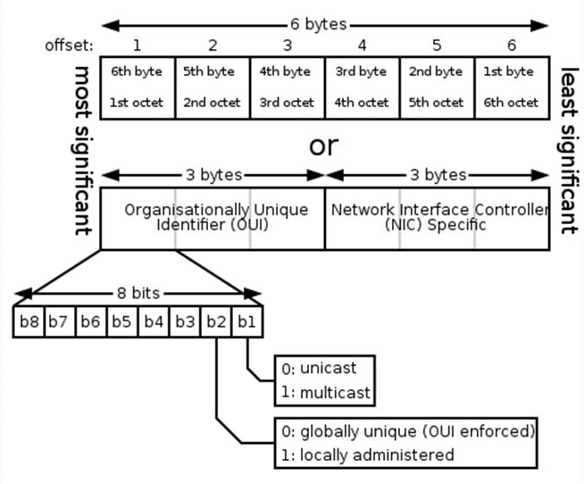

    EUI-48 = 48비트의 확장 고유 식별자
    xx-xx-xx-xx-xx-xx 총 6옥텟 = 48 bit  
    첫 3옥텟: OUI = 제조사 번호  
    뒤의 3옥텟: NSI = 제조사가 부여한 해당 기기 일련번호  
  

2. powershell  

    ipconfig -all  
    좀 더 자세한 내 네트워크 정보

    arp -a  
    지금까지 통신한 주소의 캐시 테이블을을 보기  
    IP 주소와 거기에 맵핑된 MAC 주소가 저장

    arp -d  
    지금까지 통신한 주소의 캐시 테이블을 지우기  
    관리자 권한 필요
    
    ping xxx.xxx.xxx.xxx  
    해당 ip로 통신을 시도해보기
    
    예시 1:  
    통신할 pc의 방화벽에 아웃바운드 ICMP프로토콜이 막혔다!  
    그래도 arp -a를 쳐보면 물리적 주소가 기록되는 이유는?

    ICMP를 보내기 전에 ARP프로토콜로 네트워크 전체에 해당 IP의 장비는 MAC을 내놓으라는 통신 시도를 하고, 이건 방화벽에 안막혀서 MAC는 성공적으로 가져올 수 있었음.
  

3. Win + R 명령어  

    ncpa.cpl = 제어판 -> 네트워크 연결
  

4. 데이터 전송 방식  

    point to point  
    unicast, broadcast, multicast, anycast

    예시1에서 ICMP는 unicast, ARP는 broadcast 방식을 사용

    unicast = 1대1 연결  
    broadcast = 1대다 연결  
    multicast = 1대n 연결  

    broadcast 방식으로 들어오면 인터럽트가 발생하는 경우가 있다  
    왜냐? -> 일단 빨리 처리해줘야되는 패킷으로 취급하는 경우가 많기 때문(무조건은 아님)
  

5. 통신 방식

    * 단방향 (Simplex)          일방통행
    * 양방향 (Duplex)  
        * 반이중 (Half-Duplex)  무전기
        * 전이중 (Full-Duplex)  일반전화기
  

6. x86 / x64  

    램과 cpu의 대역폭이 32bit냐 64bit냐의 차이 
    x64는 x86시리즈를 64비트로 확장시킨 아키텍처로 x86_64로 명명했다.
  

7. wireshark  

    네트워크 패킷을 캡처해서 볼 수 있는 도구  
    네트워크 장비를 통하는 이더넷 프레임을 죄다 녹화해서 저장한다.  
    필터링과 각 프로토콜마다 분석 기능이 있어서 재미있다.  
    집에서 해봐야지.
  

8. Hub & Switch Hub  

    #### 허브
    
    허브는 연결된 네트워크의 장비들의 통신을 죄다 브로드캐스팅으로 바꿔버림.  
    딱봐도 문제가 있겠죠?

    #### 스위치 허브의 등장

    허브에 MAC 테이블을 집어넣어서 Unicast로 바꿔준다. 
    네트워크 부하가 확 줄어들겠죠? 
    그치만 A는 B와 C의 연결을 전혀 알 수 없어요. 

    #### Managed 허브

    얘는 포트별로 MAC테이블을 사용자가 Manage 할 수 있다. 

    multicast 방식으로 모든 연결을 A에게도 보내줘! 같은게 가능해서 네트워크 감시할 때 좋을 듯.
  

9. ARP 프로토콜  

    #### Address Resolution Protocol 주소 결정 프로토콜  
    IP 주소에 MAC 주소로 변환하는 프로토콜이다. 
    BroadCast 방식으로 전 네트워크에 "이 IP 가진 사람은 자기 MAC 주소 반송해주세요"라고 요청하면 받은 사람이 MAC주소를 반송하게되고,
    이를 이더넷 프레임 헤더의 MAC Destination에 넣을 수 있다. 

    #### 특성
    Ethernet통신을 시작할 때 반드시 실행된다. 
    
    이더넷으로 전세계를 묶으면 부하가 미쳐날뛰겠지요? 
    이 때문에 broadcast는 정책적으로 네트워크를 벗어나지 못하게 만들어서 Ethernet통신으로 묶인 네트워크를 LAN으로 정의할 수 있겠다.
  

### 5주차 학습 내용:  

1. IP 프로토콜 

    Ethernet프로토콜은 LAN이라면 IP프로토콜은 외부 네트워크과 통신 하기 위한 방식이다. 

    이때 네트워크와 네트워크를 잇는 소규모 연결도 네트워크다! 
    
    라우터가 주소체계를 보고 우리 네트워크에 있으면 2계층(이더넷)에서 그냥 처리함. 
    근데 우리 네트워크에 없다? 
    다른 네트워크에 거기서 처리해줘! 한다  
    내 네트워크를 벗어난 놈에 대해 신경을 안쓴다는 것.

    ip는 오류제어, 흐름제어, 혼잡제어 기능이 없음.

    #### 게이트웨이

    게이트웨이는 내 네트워크에 있는 "외부 네트워크와 연결된 장비"다. 
    기본 게이트웨이는 하나가 디폴트로 들어가있고, 수동으로 더 추가할 수 도 있다. 
    우선 순위는 route print 명령어로 볼 수 있는 라우팅 테이블 중 '활성 경로:' 에서 확인 할 수 있다.  

    그래서 게이트웨이가 잘 못 설정되어있다면?  
    내부 통신에는 문제가 없으나 외부 통신이 먹통이 된다! 

    #### 게이트웨이가 작동하는 방법(외부로 패킷을 보내는 방법)
    
    1. 우리 네트워크에 찾는 장비가 없다.
    2. 게이트웨이에게 보낸다.
    3. 게이트웨이가 외부 네트워크로 보낸다.
    4. 첫번째 외부 네트워크에도 없다?
    5. 무 한 반 복

    들어오는 패킷에 관한 건 교수님이 나중에 알려준데 

    IP프로토콜은 기본적으로 흐름제어나 부하관련한것에 신경을 안쓴다.  
    대신 오류메세지정도의 정보는 돌려줄때가 있는데 이때는 ICMP 프로토콜을 사용한다.  
    맞아 Ping쓰던 프로토콜이야.  
    연결이 제대로 되었는지의 체크를 도와주는 프로토콜이라고 생각하자.  

    #### IP의 구조  

    IP주소 이전의 네트워크 주소는 그냥 32비트짜리 쭉 이어진 주소였음. 
    모든 인터넷 네트워크를 하나로 묶을 생각이였으니까. 
    근데 부하가 말도안되게 걸리기 시작해서 만들어진게 IP  
    기존의 주소를 역할별로 나눠서 NetworkID/HostID 로 분할해서 지정하기 시작했다. 

    이때 클래스를 만들기 시작함 (Classful) 
    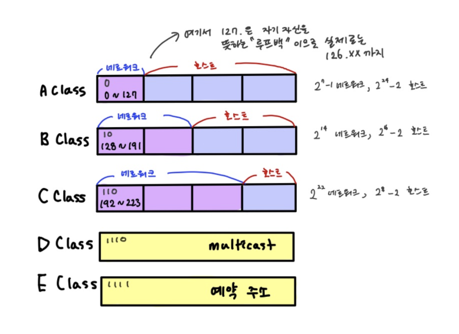
    그런데 만약 내가 4개의 장비만 넣을 수 있는 네트워크를 만들려해도 C클래스, 즉 256개짜리 네트워크를 사용해야한다. 

    CIDR의 등장 (Classless Inter Domain Routing) 
    subnetting/supernetting을 통해서 네트워크의 크기를 자유자재로 조절 할 수 있게 되었다.
    
    이걸 위한 표기법이 추가되는데 xxx.xxx.xxx.xxx/n <- 여기에 몇비트까지 네트워크 아이디인지 적어두는 방식이 생김 
    근데 이거 서브넷 마스크로 대체 가능한데 서브넷 마스크는 다음 시간에

    * IPv4 헤더의 구조
    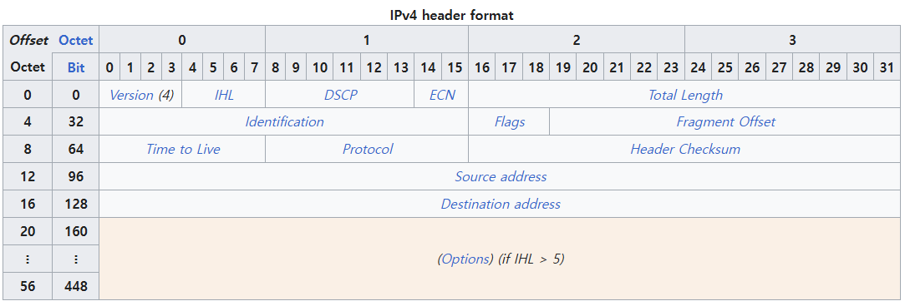
    
    IPv6는 Anycast 같은 통신 방식도 지원한다. 
    이건 부하 조절에 쓰이는 방식이라 상위 계층에서 제어하던걸 살짝 내려서 쓴다는 느낌으로 알면 됨 
    
    #### 특수 주소  

    0.0.0.0 = 내가 아닌 모든 네트워크(바깥으로 연결? 그런 느낌인듯)  
    클라이언트 입장에서는 인터넷으로의 연결 / 서버 입장에서는 모든 클라이언트와의 연결 

    255.255.255.255 = BroadCasting  
    게이트웨이를 벗어나지 않는 내부 네트워크에 있는 모든 장비에게 연결 

    xxx.xxx.xxx.0 = 호스트 아이디가 0이면 네트워크 그 자체를 의미  
    xxx.xxx.xxx.255 = BroadCasting for xxx.xxx.xxx.~~~  

    해당 번호는 0,255 고정이 아니라 가장 적은 수, 가장 큰 수를 기반으로 함. 
    예시로 서브네팅해서 0~64, 65~128로 최대치가 줄어들면 그중 가장 큰 수를 BroadCasting으로 지정함 
    그래서 서브네팅으로 네트워크를 나누면 나눈만큼 * -2 개의 호스트 아이디를 저 두개에 지정해서 쓸 수 없게 된다 

    127.xxx.xxx.xxx = LoofBack 

    #### DLS 

    DLS가 뭐냐? 
    그냥 웹주소와 IP를 매칭시켜서 잔뜩 저장하고있는 서버라고 생각하자 
    다음 이 시간에 계속~
  

    

### 6주차 학습 내용:  

1. IP 프로토콜 

    #### 서브넷 마스크

    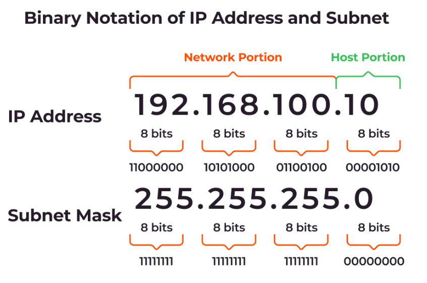

    #### 라우터(Router)  
    라우터는 네트워크 경계에 있는 IP 프로토콜 장비이다. 
    L3 스위치라고 볼 수 있다.

    라우터가 없으면 사설ip 네트워크 바깥으로 나갈 수 없음. 

    #### 사설 주소 대역(Private address range)
    직접적으로 인터넷에 연결할 수 없는 IP로, A,B,C 클래스로 나뉨. 

    왜 이렇게 만들었나? -> 나중에 합칠 일이 있으면 내부 장비들끼리 죄다 같은 아이피면 좀 그렇자너. 
    즉 그냥 내부 식별용이지 큰 의미는 없음. 
    
    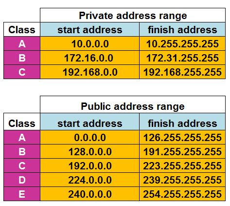  
    인터넷으로 못나가는 이유는 3계층 장비에서 사설 ip는 드롭해버리기 때문. 

    #### NAT
    라우터는 사설IP 장비가 보내는 통신의 헤더부분에 Source를 라우터의 주소로 바꿔줌 + 바꾼 사실을 헤더에 추가한다 
    외부로 나갈때 Source는 라우터의 주소, Destination은 인터넷 주소가 되고, 들어올때는 그 반대가 된다. 

    그렇게 라우터에 패킷이 들어오면(dst가 라우터 주소니까) 내부 네트워크에 Destination을 내 장비 IP로 바꿔서 집어넣어준다.
  

2. 방화벽 F/W 

    방화벽은 랜선이 꽂힌 네트워크 인터페이스 카드(NIC)를 통하는 연결(출,입 전부)을 1차적으로 검사하고 차단한다. 

    외부에서 방화벽으로 들어오는 통신을 inbound, 장비에서 외부로 내보내는 통신을 outbound로 규정하고 각자 다른 규칙으로 필터링한다. 
    
    방화벽은 컴퓨터 소프트웨어로만 있는게 아니라 물리적 장비로도 있다.
  

3. NIC가 두개? 

    NIC가 두개인 경우가 뭐가 있을까 싶지만 핸드폰의 핫스팟이 그런 경우다. 
    아웃바운드 통신은 방화벽이 막는게 거의 없지만 이런 경우(어떤 NIC로 들어온 통신이 다른 NIC로 나가는 경우)에는 막히는게 좀 더 많아진다.
  

4. advenced IP Scanner 

    네트워크에 어떤 장비가 붙어있는지 보기 쉽다. 
    스캐닝이기 때문에 함부로 하면 혼난다. 

    보안시스템 없는 안전한(?) 사설망에서 새 장비 추가했는데 연결이 됐나 안됐나 볼때나 쓰시오. 

    xxx.xxx.xxx.0-255 같은 형식으로 필터링 가능 
    xxx.xxx.0.0 - xxx.xxx.100.255 같은 방식으로도 가능
  

5. Filezilla

    FTP프로토콜을 사용해서 서버-클라이언트를 연결해주는 프로그램. 
    주소, ID, PW, 포트를 적으면 연결을 해줘요! 와하!
  

6. UDP

    UDP(User Datagram Protocol)는 4계층 프로토콜로 2~3계층은 장비간 통신에 중점이 맞춰저 있다면 4계층부터는 프로그램 사이의 연결에 의미를 둔다. 
    이를 위해서 포트 번호를 사용해서 프로그램을 구별한다.

    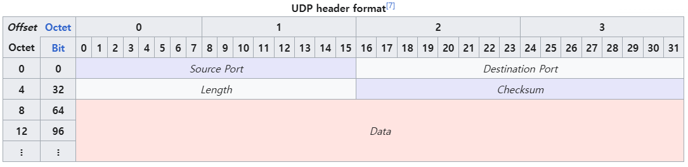  

    UDP는 가능한 데이터를 쪼개서 보내지 않는다. 
    또한, IP처럼 제어기능이 없다. 

    응답할 때까지 무지성으로 계속 보낸다. 
    그래서 데이터를 좀 놓쳐도 상관없고, 속도가 중요한 분야에서는 써먹기 좋다. 
    헤더만 봐도 가볍고 작동방식도 간단해서 빠르니까  

7. VLC Player

    현존하는 거의 모든 코덱을 가지고 있는 동영상 플레이어. 
    네트워크 영상을 볼 수 있는 기능이 있다! 
    CCTV 영상 같은 걸 연결해서 받아볼 수 있다.
  
    

### 7주차 학습 내용:  

1. 포트번호  

    0~65535, 2바이트 
    0~1024 => Wellknown Port -> 앵간해선 쓰지마라 (주로 쓰이니까) 
    1025~4096 => 여기도 슬슬 자주 쓰임 
    45k~64k => 시스템이 자동 할당해주는 포트 -> 자동 할당 포트, 굳이 쓸 필요는 없다. 

    Process가 OS에게 포트번호를 지정해주면 지정한 포트를 사용하고, 지정하지않으면 빈 포트중에 하나로 자동할당된다. 

    TCP 포트번호와 UDP 포트번호는 별개다. 
    두 프로토콜을 동시에 실행한다면 같은 번호를 할당할 수 있다.
  

2. Socket Test 3 

    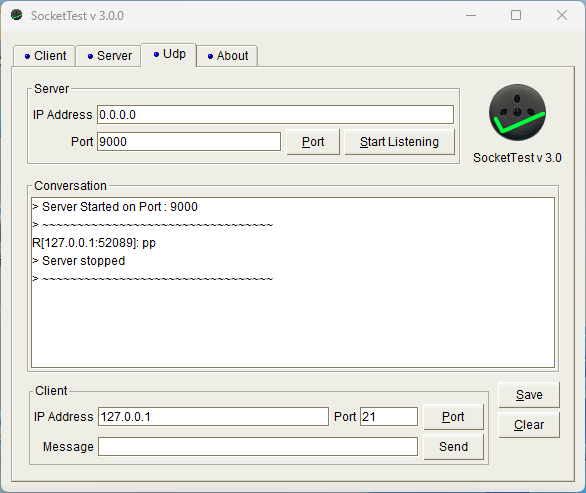  

    #### Udp
    지정한 IP와 Port로 메세지를 송수신 할 수 있다. 
    받을때 쓰이는 포트는 지정할 수 있지만, 보낼때 쓰는 포트는 자동할당. 
    그래서 보낼때 쓰이는 포트로 지정하고 보내도 받을 수는 있다. 
    서버를 연게 아니라 그냥 포트를 열어둔 것이기 때문. 

    #### TCP
    연결 지향형 프로토콜 
    아래 Client와 Server 탭은 전부 TCP를 사용한다. 
    서로 연결 되기 전 까지는 메세지를 보낼 수 없다. 

    #### TCP - Server
    서버를 열 IP와 포트를 지정한다. 

    #### TCP - Client
    IP와 포트로 연결을 시도한다. 
    연결이 되었다면 메세지 보내기가 가능하다.
  
    
3. 명령어 

    netstat -a 

    현재 프로그램이 점유중인 포트를 전부 보여줌 
    내 컴퓨터의 포트와 그게 연결된 외부 포트, TCP의 연결 상태를 보여줌
  

4. TCP 

    흐름제어, 오류제어가 가능한 프로토콜이다. 
    받는 쪽의 버퍼 상태 같은 것에 의거해서 데이터를 쪼개서 보낼 수 있고, 받는 쪽은 순서가 잘 못 들어오거나 누락된 부분을 재요청 해서 완전한 하나의 데이터를 만들어서 읽는다. 

    #### 3-way HandShake
    TCP 최초의 연결을 위해 클라이언트->서버->클라이언트->서버로 이어지는 3번의 통신 과정. 
    종료시에는 4-way HandShake를 사용함. 

    #### Acknowledgement (ACK)
    TCP 프로토콜에는 들어온 통신에 대해 답을 할 의무가 있음. 
    답이 돌아오지않으면 연결이 됐다고 취급하지않기 때문 

    #### State
    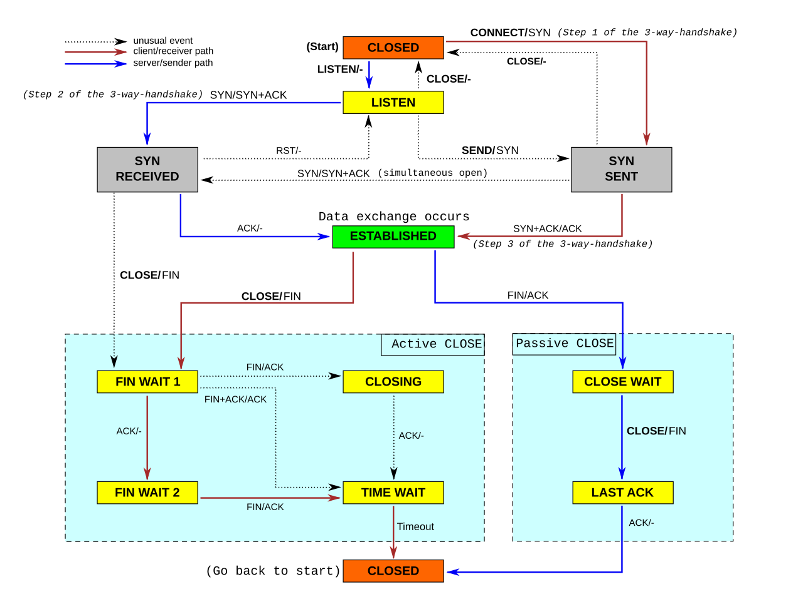  

    Established 상태에서 서버-클라이언트 통신이 가능하다. 

    선에 있는건 '상태변화를 위해 받은것'/'답장할 것' 으로 읽으면 된다.
  

### 8주차 학습 내용:  

1. DNS 
    
    Domain Name Service 

    URL과 IP주소를 1대1 혹은 1대다로 맵핑하는 서비스 

    컴퓨터는 URL을 뒤부터 읽는다. 

        .com / 닷컴이네?
        .naver / 네이버네?
        .www / 웹서버네?

    초기 도메인 네임 서버는 그냥 URL과 IP를 지정해서 한 서버가 전부 가지고 있었다. 
    도메인 네임이 너무 많아지니 도메인 네임에 규칙성을 부여하고 서버를 분할해서 부하를 줄이려함. 
    
    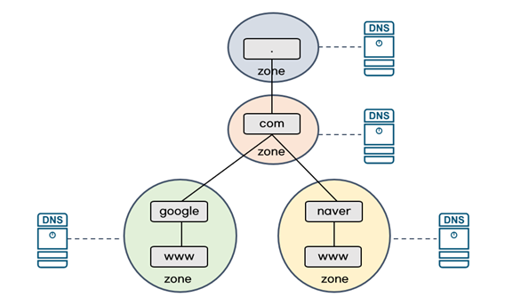  

    #### 최상위 도메인
    DNS 서버 구조상 가장 위에 있는 RootDNS 서버가 우선 구별 할 수 있게 하는 부분  

    .com 이나 .net 같은 것이 해당된다.
  

2. resolve file 

    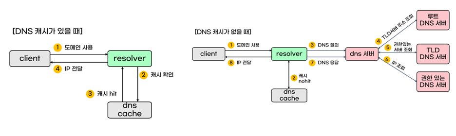  
    path : Windows\System32\drivers\etc\hosts  
    DNS가 실행되기전 우선 이 파일에서 URL이 있는지 찾아본다. 
    여기 URL과 IP가 맵핑되어 있으면 DNS를 실행 안한다. 

    즉, 여기에 내가 이름을 "Desktop1"로 지정하고 아이피를 때려넣으면 ping Desktop1 하면 그 아이피로 바로 되는 거여.
  

3. Powershell 명령어 
    
    #### nslookup
    nslookup 뒤에 URL을 넣으면 URL이 가리키는 주소와 이를 알려준 DNS 서버의 주소를 알려준다. 
    nslookup만 치면 주소만 쳐도 계속 해당 기능을 사용할 수 있다.

    #### ping \[URL 주소\] 
    해당 URL을 리졸브 파일에서 찾아보고 없으면 DNS 서버에 물어보러간다. 
    획득한 IP주소로 ping은 덤.
  

4. PacketSender

    #### 패킷 저장 기능 
    받거내 보낸 패킷을 저장하거나, 저장된 패킷의 정보를 통해 보낼 IP, 포트, 프로토콜을 바로 기입할 수 있다. 

    #### 자동으로 보내기 
    Resend Delay를 설정하면 해당 초마다 계속 보내기 시작한다. 

    #### 간단한 서버 열기 
    설정창에서 포트를 미리 지정해두면 하단의 버튼 딸깍으로 키고 끌 수 있다. 

    #### 멀티 유저 서버 
    Persistent TCP 기능을 비활성 하면 동시 접속을 처리 할 수 없다. 
    하나를 연결한 상태로 다른걸 연결하려 들면 접속이 끊긴다. 
    해당 기능을 활성화하면 연결 할 때 마다 새 창이 뜨면서 서버 포트 번호를 재할당시킨다. 
    
    작동 방식은 서버의 포트로 들어온걸 발신자에 따라서 창을 나눠서 보여주는 것으로 추정중... 
 

4. SocketTest와 SerialPortMon의 차이 

    #### PreFix & PostFix
    SocketTest는 접두사,접미사 기능이 없다. 강제로 접미사 "\r\n"이 붙기는 함. 
    SerialPortMon은 해당 기능을 가지고있다. 

    #### TCP 연결 유지
    SocketTest는 TCP 연결이 끊기면 그대로 종료된다. 
    SerialPortMon은 연결 지속형이라 매초 재접속을 시도한다. 
    서버가 닫히면 2회 정도만 시도하고 그만두지만 서버에서 접속만 끊는다면 바로 재접속이 시도된다.  

    #### DNS
    SocketTest는 DNS를 사용가능. 
    SerialPortMon은 DNS 사용이 안된다 

    #### HEX로 읽기
    SocketTest는 아스키값으로만 출력되지만, 
    SerialPortMon은 Hex값으로 읽을 수 있다. 

    
### 9주차 학습 내용:  

개쳐망했어 개쳐자버렸어

1. Multi-cast 

    #### IPv4
    Class D의 아이피 224~239는 멀티캐스트를 위해서 쓰인다. 
    224.0~~~이렇게 나오면 대충 멀티캐스트겠구나~ 하면 됨. 

    이더넷 레벨에서도 나타나는데 ARP를 쳐보면 MAC주소가 01-00-5e 로 시작하면 멀티캐스트라 보면 된다. 
    뒤에 오는건 224.x.x.x의 x.x.x와 동일한걸 가리킨다.(대신 16진수로 MAC 이니까) 

2. HTTP 
    
    #### 프로토콜
    7계층 프로토콜로, 보통 80번 포트로 연결한다. 
    클라이언트의 요청으로 서버에 연결하고, 응답을 받으면 그 즉시 연결을 끊어버린다. 
    Connectless 하네요~ 

    #### HTTP 메소드
    GET : 데이터를 읽거나 검색하기위해 쓰는 메소드.

    POST : 데이터를 입력하기위해 쓰는 메소드.

    #### HTTP Response status codes
    HTTP 프로토콜로 연결했을때 응답하는 코드

        100~199 정보
        200~299 성공
        300~399 리다이렉션
        400~499 클라이언트 에러
        500~600 서버 에러
    

3. 웹크롤링 

4. Powershell

    PowerShell은 cmd를 포함하는 더 큰 Shell프로그램임. 
    Hardware <-> OS <-> Application 이런 구조라고 알고 있음.  
    Shall은 OS와 Application(Process)사이에 들어가 있는 OS 의 껍질이라고 보면 됨. 

    컴파일 언어 C 
    인터프리터 언어 Python 
    스크립트 언어 PowerShell 
    
    전부 네트워크 프로그래밍이 가능함. 
    대신 속도가 올라갈 수록 메모리 효율이 떨어지고 암튼 그럼...서로 다름. 

    #### 명령어
    Start-Process 
    arp  
    ping 
    ipconfig 
    netstat 
    route print 
    Get-NetAdapter 
    Get-NetNeighbor 
    Get-NetIPInterface 
    Get-NetIPConfiguration 

    ipconfig와 차이점 
    Get-NetIPConfiguration은 오브젝트를 반환하고, ipconfig는 String을 반환함.

    그래서 ipconfig는 문자열을 필터링이나 뭘 하려면 ' ipconfig | findstr "~" '이런 식으로 파이프를 사용해서 다음 명령어에게 문자열을 넘겨주는 방식임. 
    Get-어쩌구는 데이터를 그대로 가져오는거라 더 다양한 접근이 가능함. 스트링을 자르고 뭐 이럴 필요가 없고, 그냥 오브젝트째로 넘겨줄 수 있음. 

    Get-NetTCPConnection 
    Get-NetUDPEndpoint 

    Resolve-DnsName : nslookup의 진화판 같은 느낌 
    Get-NetRoute : route print의 진화판이지 뭐 
    
    netsh : 네트워크용 쉘을 쓰겠다~ 이런 느낌 

    netsh int ip add nei "이름" xxx.xxx.xxx.xxx xx-xx-xx-xx-xx-xx 
    레지스트리에 이 이름, IP, MAC을 저장시켜놓겠다. 
    즉, ARP 캐시리스트에 정적으로 저장되게 된다. 
    되돌리고 싶을 땐 arp -d 맥이고 MAC를 비운채로 다시 치면 동적으로 돌아간다. 

    #### 인터페이스 인덱스
    NIC - 물리적 구성 
    Interface - 논리적 구성 

### 10주차 학습 내용:  

    *휴 강*

### 11주차 학습 내용:  

1. RDP 
    
    Remote Desktop Protocol 
    원격 데스크탑에 사용되는 프로토콜. 
    원격 데스크탑은 윈도우 기본 기능으로 들어가있음. 
    서버는 home에는 없고 pro에 있음 

2. TightVNC 

    호스트에 접속해서 호스트가 보여주는 화면을 그대로 송출함. 

3. 소켓 통신 

    운영체제를 가리지않아요 

    #### 소켓 통신 절차

    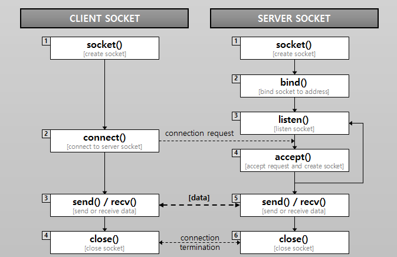  
    
4. winsock 실습

    #### Big Endian & Little Endian
    CPU 아키텍쳐의 종류, 네트워크로 보낼때는 반드시 Big Endian으로 변형해서 보낸다. 
    받을때는 각자 CPU에 맞게 읽으면 되니까. 

    hton() 로 네트워크로 내보내는 데이터를 변형하고,
    ntoh() 로 네트워크에서 호스트로 들어오는 데이터를 변형함.

5. 11주차 실습: CPP, Python으로 TCP 클라이언트 만들기

