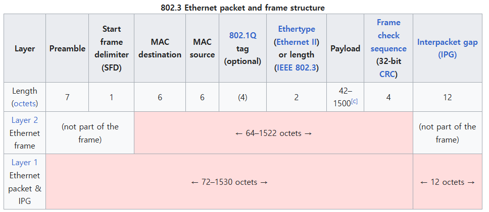

# 2025_1_ServerProgramming 

### 1주차 학습 내용:  

1. 네트워크 토폴로지 이론  

    Star, Mesh, Ring, Bus등 구조와 그에 따른 장단점

2. OSI 7계층  

    OSI 7계층이 만들어진 배경과 각 계층의 역할
    

3. WAN / LAN  

    WAN과 LAN의 구분

### 2주차 학습 내용:  

1. OSI 참조 모델  
    각 레이어에 있는 프로토콜의 예시  
    
    
2. 각 프로토콜이 데이터를 주고받는 형태  
    이더넷 프레임의 Header 형태 같은 것들을 여러가지 공부했다.
    

### 3주차 학습 내용:
휴강

### 4주차 학습 내용:  

1. 물리적 주소 MAC  

    MAC의 구조  
    xx-xx-xx-xx-xx-xx 총 6옥텟 = 48 bit  
    첫 3옥텟: OUI = 제조사 번호  
    뒤의 3옥텟: NSI = 제조사가 부여한 해당 기기 일련번호  

2. powershell  

    ipconfig -all  
    좀 더 자세한 내 네트워크 정보

    arp -a  
    Address Resolution Protocol 주소 결정 프로토콜
    지금까지 통신한 주소의 캐시 테이블을을 보기  
    IP 주소와 거기에 맵핑된 MAC 주소가 저장

    arp -d  
    지금까지 통신한 주소의 캐시 테이블을 지우기  
    관리자 권한 필요
    
    ping xxx.xxx.xxx.xxx  
    해당 ip로 통신을 시도해보기
    
    예시 1:
    통신할 pc의 방화벽에 아웃바운드 ICMP프로토콜이 막혔다!
    그래도 arp -a를 쳐보면 물리적 주소가 기록되는 이유는?

    ICMP를 보내기 전에 ARP프로토콜로 네트워크 전체에 해당 IP의 장비는 MAC을 내놓으라는 통신 시도를 하고, 이건 방화벽에 안막혀서 MAC는 성공적으로 가져올 수 있었음.

3. Win + R 명령어  

    ncpa.cpl = 제어판 -> 네트워크 연결

4. 네트워크 토폴로지  

    point to point  
    unicast, broadcast, multicast, anycast

    예시1에서 ICMP는 unicast, ARP는 broadcast 방식을 사용

    unicast = 1대1 연결  
    broadcast = 1대다 연결  
    multicast = 1대n 연결  

    broadcast 방식으로 들어오면 인터럽트가 발생하는 경우가 있다  
    왜냐? -> 일단 빨리 처리해줘야되는 패킷으로 취급하는 경우가 많기 때문(무조건은 아님)

5. x86 / x64  

    램과 cpu의 대역폭이 32bit냐 64bit냐의 차이 
    x64는 x86시리즈를 64비트로 확장시킨 아키텍처로 x86_64로 명명했다.

6. wireshark  

    네트워크 패킷을 캡처해서 볼 수 있는 도구  
    네트워크 장비를 통하는 이더넷 프레임을 죄다 녹화해서 저장한다.  
    필터링과 각 프로토콜마다 분석 기능이 있어서 재미있다.  
    집에서 해봐야지.

7. Hub & Switch Hub  

    #### 허브
    
    허브는 연결된 네트워크의 장비들의 통신을 죄다 브로드캐스팅으로 바꿔버림.  
    딱봐도 문제가 있겠죠?

    #### 스위치 허브의 등장

    허브에 MAC 테이블을 집어넣어서 Unicast로 바꿔준다. 
    네트워크 부하가 확 줄어들겠죠? 
    그치만 A는 B와 C의 연결을 전혀 알 수 없어요. 

    #### Managed 허브

    얘는 포트별로 MAC테이블을 사용자가 Manage 할 수 있다. 

    multicast 방식으로 모든 연결을 A에게도 보내줘! 같은게 가능해서 네트워크 감시할 때 좋을 듯.

